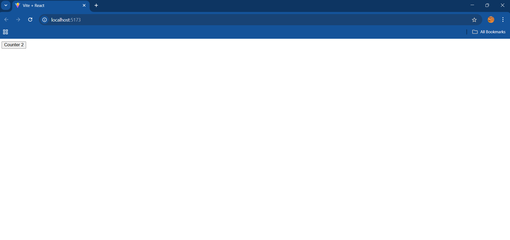

# 📚 Day 04 – Understanding State, Components & Re-Rendering in React ⚛️

## 🧠 What I Learned

### ✅ React State – The Heart of Interactivity

* `useState()` is a **React Hook** that lets you store and manage component-level state.
* When the state updates, React **automatically re-renders** the affected component.

```jsx
const [count, setCount] = useState(0);
```

---

### ✅ Components – Building Blocks of React

* Each piece of UI (like a button or heading) can be a **component**.
* Components help in **reusability** and better **code organization**.
* Follow **PascalCase** for component names (`CounterButton`, not `counterButton`).

---

### ✅ Re-Rendering – What Really Happens?

* When a component’s state or props change, React triggers a **re-render**.
* But thanks to the **Virtual DOM**, React only updates what's necessary, making it efficient.

---

## 🔨 Mini Project: Click Counter App 🧮

Today, I built a **simple dynamic counter app** that increments the number when you click a button!

### 🔁 Features:

* Button that increments a counter on click.
* Real-time UI updates using `useState()`.
* Component-based structure.

## 🧪 Output Screenshot





---

## 🧰 Tools Used

* React (with Vite or CRA)
* `useState` Hook
* JSX & Functional Components

---

## 🔍 Key Takeaways

| Concept      | Insight                                       |
| ------------ | --------------------------------------------- |
| `useState()` | Hook for managing local state in a component  |
| Components   | Encapsulated, reusable UI blocks              |
| Re-rendering | Automatically happens when state/props change |

---


