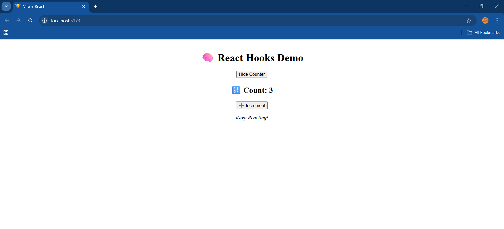

# 🚀 Day 05 – Diving Deeper into React ⚛️

## 📚 What I Learned Today

Today was all about enhancing my React skills with some core concepts:

### 🔁 `useEffect` Hook
- Learned how to **perform side effects** in function components.
- Explored **dependency arrays** to control when effects run.
- Implemented **cleanup functions** to prevent memory leaks.

### 📦 Props
- Understood how to **pass data** between components.
- Created reusable components using **props**.

### 🔀 Conditional Rendering
- Displayed content dynamically based on conditions using:
  - `if/else`
  - Ternary operators
  - Logical `&&` expressions

---

## 🧠 Key Takeaways

- Side effects like **fetching data, setting timers**, or **event listeners** should be handled inside `useEffect`.
- Forgetting the cleanup function can lead to bugs like **duplicate API calls** or **memory leaks**.
- Props make components **modular** and **maintainable**.
- Conditional rendering lets us create **interactive UIs** that change with user actions.

---

### 📸 Output Screenshot

