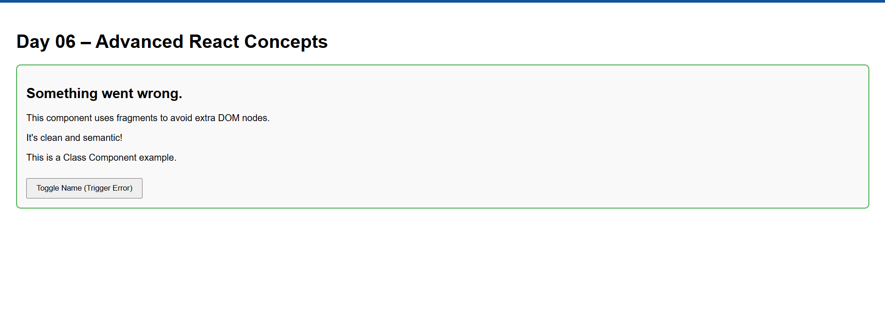

# ⚙️ Day 06 – Advanced React Component Patterns 🔧

## 📚 What I Learned Today

Today was packed with deeper insights into React's component system and design patterns:

### 👶 Children Props
- Discovered how to pass nested JSX using `props.children`.
- Useful for building **layout wrappers** and **nested UI components**.

### 🎨 Inline Styling
- Learned to style components using **JavaScript objects**.
- Syntax requires **camelCase** instead of kebab-case (e.g., `fontSize` not `font-size`).

### 🆚 Class vs Functional Components
- Explored the difference between:
  - **Class Components**: Older, use `this.state` and lifecycle methods.
  - **Functional Components**: Simpler, modern, and hook-friendly.

### 💎 React Fragments
- Used `<></>` (fragments) to return **multiple elements** without adding extra nodes to the DOM.

### 🧯 Error Boundaries
- Understood how to catch JavaScript errors in components with **Error Boundaries**.
- Only **class components** can implement them.
- Used to show a **fallback UI** instead of crashing the entire app.

---

## 🧠 Key Takeaways

- `children` helps in making components **composable and reusable**.
- Inline styling is quick and **scope-safe**, though not always ideal for complex UIs.
- **Functional components with hooks** are the go-to in modern React development.
- Fragments clean up the DOM and prevent unnecessary nesting.
- Error boundaries enhance app **resilience and user experience** during crashes.

---

## 📸 Output Screenshot

