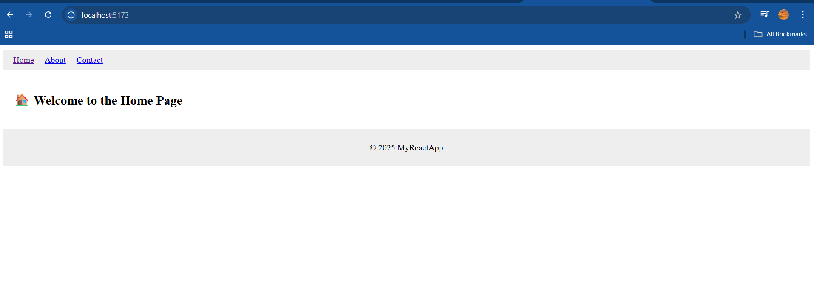

# 🌐 Day 07 – Navigating the React World with SPA & Routing 🧭

## 📚 What I Learned Today

Today was all about structuring modern React applications using **routing**, **layouts**, and understanding the **SPA (Single Page Application)** architecture.

### 🧾 Single Page Applications (SPA)
- React apps are typically **SPAs**, meaning:
  - There's only **one HTML page** (`index.html`)
  - Navigation between "pages" doesn’t reload the browser.
- Fast and dynamic UI updates using **JavaScript and Virtual DOM**.

### 🗺️ React Router
- Implemented routing using `react-router-dom`.
- Created multiple routes for different pages like:
  - `/` → Home
  - `/about` → About
  - `/contact` → Contact
- Used:
  - `<BrowserRouter>` to wrap the app.
  - `<Routes>` and `<Route>` for defining paths.
  - `<Link>` and `<NavLink>` for navigation without reloads.

### 🧱 Layouts in React
- Designed reusable layouts like `Navbar`, `Footer`, and a `Main` container.
- Used `Outlet` from `react-router-dom` to render nested route content inside the layout.

---

## 🧠 Key Takeaways

- SPAs provide a **smooth user experience** by avoiding full-page reloads.
- Routing in React helps in building **modular**, **navigable**, and **multi-view** UIs.
- Layout components help avoid repetition and make the UI **clean and consistent**.
- `Outlet` allows you to **nest routes dynamically** under a parent layout.

---

## 💻 Project Snapshot

I built a simple multi-page React app with:
- A navbar to switch between pages.
- Layout component wrapping all pages.
- Nested route rendering using `Outlet`.

### 📸 Output Screenshot

