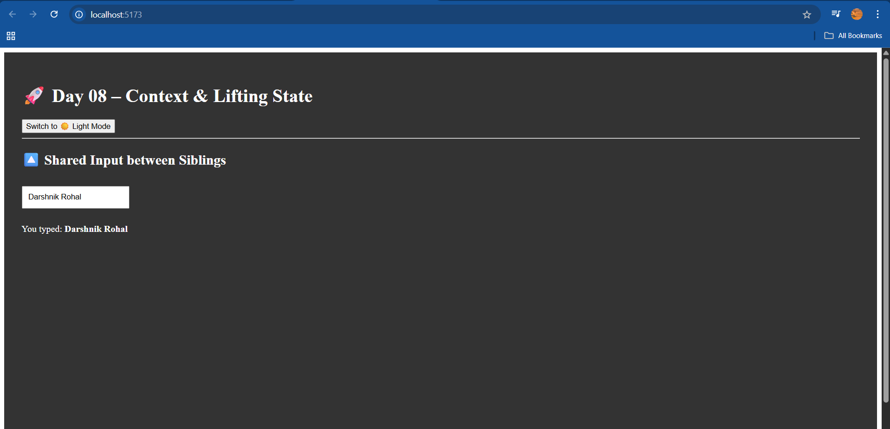

# 🚀 Day 08 – Context API & Lifting State in React ⚛️

## 📚 What I Learned Today

Today was focused on advanced React state management techniques:

### 🌐 Context API
- Eliminates the need for **prop drilling** by sharing state globally.
- Uses:
  - `React.createContext()` to create a context.
  - `<Context.Provider value={...}>` to supply the context value.
  - `useContext(Context)` to access it in any child component.

### 🔼 Lifting (Rolling Up) State
- When multiple components need access to the same state, lift the state up to their **common parent**.
- Promotes better **data synchronization** and **component reusability**.

---

## 🧠 Key Takeaways

- The **Context API** is best for **global values** like user settings, theme, authentication status, etc.
- **Lifting state** makes data flow more **controlled and predictable** in a component hierarchy.
- Use Context wisely to **avoid over-complication** in small components.

---

## 💻 Project Snapshot

I built a React app that:

- 🌓 Uses `Context API` to toggle between light and dark themes across components.
- 🔄 Shares and syncs input data between sibling components using **lifted state**.

---

## 📸 Output Screenshot

