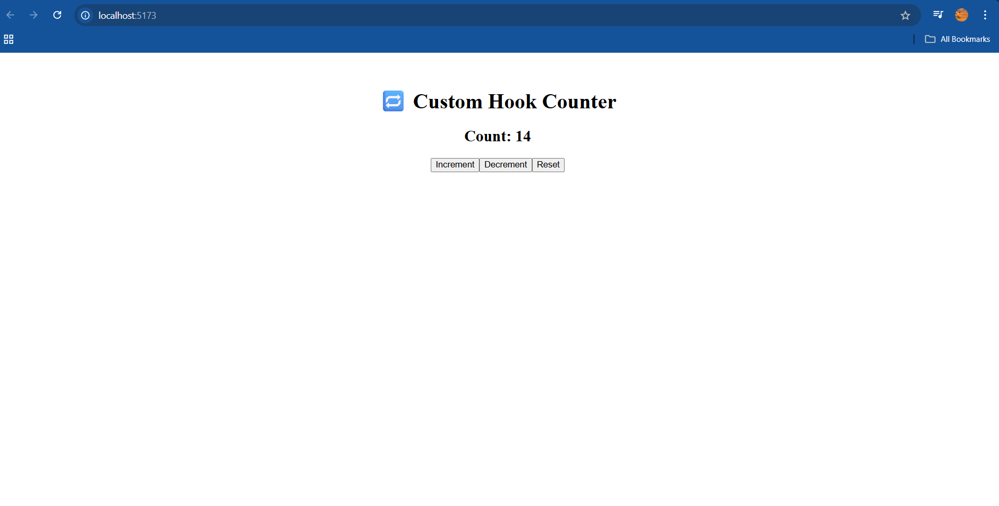

# 🚀 Day 09 – Mastering Custom Hooks in React 🧠

## 📚 What I Learned Today

Today I explored one of the most powerful features in React: **Custom Hooks**.

### 🔄 Custom Hooks
- Allow you to **extract reusable logic** from components.
- Start with `use` (e.g., `useCounter`, `useToggle`).
- Make your code **cleaner**, **DRY**, and more **testable**.
- Use built-in hooks like `useState`, `useEffect`, etc., inside your custom hooks.

---

## 🧠 Key Takeaways

- Custom Hooks **simplify logic reuse** without changing component hierarchy.
- Great for tasks like:
  - Form handling
  - API fetching
  - Counter logic
  - Toggling states
- They follow the **same rules** as built-in hooks:
  - Call hooks at the **top level**
  - Only call hooks from **React functions**

---

## 💻 Project Snapshot

I built a React app that:

- 💡 Demonstrates a `useCounter` custom hook to manage increment/decrement.
- 🧩 Keeps components clean and readable by moving logic into hooks.

---

## 📸 Output Screenshot

