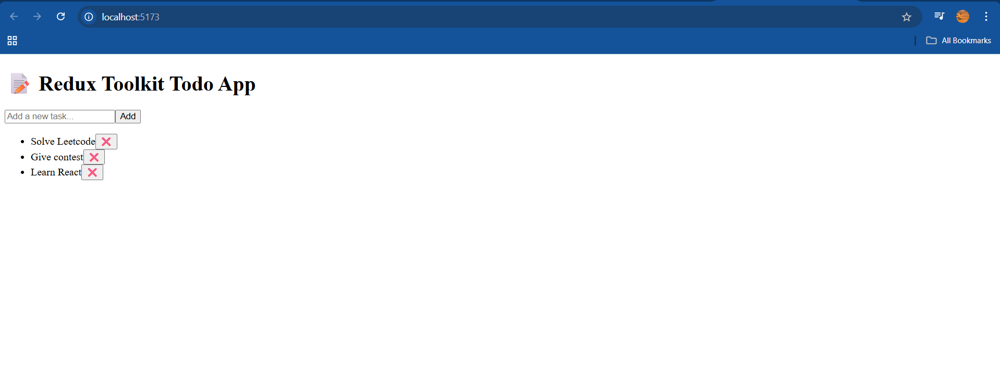

# 🚀 Day 11 – Redux Toolkit in React ⚛️

## 📚 What I Learned Today

Today was all about **state management** at scale using the **Redux Toolkit** – the official, recommended way to use Redux in modern React apps.

### 🧠 Redux Toolkit Basics
- Eliminates boilerplate of traditional Redux.
- Provides `createSlice`, `configureStore`, and powerful dev tools out of the box.
- Uses **Immer** internally to let you write "mutating" code safely.

### 📦 Key Concepts Explored:
- **createSlice**: Combines reducers + actions in one place.
- **configureStore**: Simplified store setup with built-in middleware.
- **useDispatch** & **useSelector**: Hooks to interact with Redux store from React components.

---

## 💻 Project Snapshot

I built a simple **To-Do List App** using Redux Toolkit:

- 🧩 Created a slice with `addTodo` and `removeTodo` actions.
- 🧠 Used `useSelector` to read todos and `useDispatch` to update them.
- 🧱 Connected everything in a clean and modular React component.

### 🔍 Features
- Add tasks.
- Remove tasks.
- All data managed in Redux store using Toolkit!

---

## 🧠 Key Takeaways

- Redux Toolkit is the **modern and recommended approach** for Redux.
- Slices make code **modular** and **scalable**.
- Great for **global state**, especially in **large applications**.

---

## 📸 Output Screenshot

